```{r setup, include=FALSE}
options(htmltools.dir.version = FALSE)
knitr::opts_chunk$set(
  fig.width=9, fig.height=3.5, fig.retina=3,
  out.width = "100%",
  cache = FALSE,
  echo = FALSE,
  message = FALSE, 
  warning = FALSE,
  hiline = TRUE
)
```

```{r, load_refs, include=FALSE}
library(RefManageR)
BibOptions(check.entries = FALSE,
           bib.style = "authoryear",
           cite.style = "authoryear",
           style = "markdown",
           hyperlink = FALSE,
           dashed = FALSE)
myBib <- ReadBib("myBib.bib")
```


```{r xaringan-themer, include=FALSE, warning=FALSE}
library(xaringanthemer)
style_duo_accent(
  primary_color = "#D9221A",
  secondary_color = "#F9A39D",
  inverse_header_color = "#FFFFFF"
)
style_mono_accent(
  base_color = "#D9221A",
  header_font_google = google_font("Aboreto"),
  text_font_google   = google_font("Montserrat", "300", "300i"),
  code_font_google   = google_font("Fira Mono")
)
#style_mono_accent(text_color = "#FFFFFF")
```
class: title-slide, inverse, no-action, center, bottom
background-position: bottom
background-image: url("images/presentacio.jpg")
background-size: cover


```{r xaringan-Extra, include=FALSE, echo=FALSE}
# remotes::install_github("gadenbuie/xaringanExtra")
xaringanExtra::use_xaringan_extra(c("tile_view", "animate_css","use_progress_bar"))
```

```{r xaringan-tachyons, echo=FALSE}
xaringanExtra::use_tachyons()
```

```{r xaringanExtra, echo = FALSE}
xaringanExtra::use_progress_bar(color = "#DDDDDD", location = "bottom", height = "10px")
```


# `r toupper(rmarkdown::metadata$title)`
### `r rmarkdown::metadata$subtitle`
----
### `r rmarkdown::metadata$author` 
#### `r rmarkdown::metadata$institute`


#### `r rmarkdown::metadata$date`

  
```{r echo=FALSE}
# .tomato5.bg-white[[bit.ly/DIPUBCN](bit.ly/DIPUBCN)]
```


---
name: WHOIAM
class: inverse, left, center, hide-logo


# `r fontawesome::fa("quote-left", a11y = "sem", fill = "#FFFFFF")` Eloi Mayordomo `r fontawesome::fa("quote-right", a11y = "sem", fill = "#FFFFFF")`
-----
.pull-left[
<p style="text-align: left;">
<big><u>FORMACIÓN</big></u>  <br>
- Licenciado en Ciencias políticas y de la Administración. (UPF).<br> 
- Máster en políticas locales y participación (UAB).<br>
- Analista de datos para la gestión pública (UB).<br>
</p>
]
.pull-right[
<p style="text-align: left;">
<big><u>EXPERIENCIA</big></u></b>
<br>
- Consultor ámbito privado en políticas públicas participativas (2005 - 2010) <br>
- Técnico en servicios sociales e infancia en situación de riesgo social - Diputación de Barcelona (2011-2021) <br>
- Técnico de la Unidad de Ciclo de Vida del Servicio de Convivencia, Diversidad y Ciclo de Vida - Diputación de Barcelona (2022 ~ ..). </a></u></b>
</p>  
]

<b> 
 
[`r fontawesome::fa("envelope", a11y = "sem", fill = "#FFFFFF")` ](mailto:eloimm@yahoo.com)<b>·</b> 
[`r fontawesome::fa("laptop", a11y = "sem", fill = "#FFFFFF")` ](https://eloimm.github.io/)<b>·</b> 
[`r fontawesome::fa("twitter", a11y = "sem", fill = "#FFFFFF")` ](https://twitter.com/eloimm) <b>·</b>
[`r fontawesome::fa("mastodon", a11y = "sem", fill = "#FFFFFF")` ](mastodont.cat/@eloimm)

???

---
name: previa
class: inverse, left, top, center, animated bounceInDown
# Previas...

.pull-left[
<p align="center">

</p>
]

.pull-right[.full-width[.content-box-red[
.red[.left[
* El aprendizaje es un proceso colectivo. Hay que organizarse.  

*  Necesitamos mayor conocimiento sobre nuestras intervenciones.

* Incorporar la evidencia y las evaluaciones en los diseños y políticas.  

* Salir del espacio de confort y ser profesionales honest@s.
]
]

<br>
.right[
[`r fontawesome::fa("laptop", a11y = "sem", fill = "#D9221A")` bit.ly/AulaSS](bit.ly/AulaSS)
]  
.right[
[`r fontawesome::fa("fas fa-file-pdf", a11y = "sem", fill = "#D9221A")` bit.ly/AulaSSPDF](bit.ly/AulaPDF)
]
]]]
---
name: preguntauno
background-position: 150% 150%
class: inverse, middle, center, animated bounceInDown
# El Estado del Bienestar <br> 
<style>
.pq{font-size: .5em;}
</style>


### Por qué / función(es)?

---
name: preguntados
background-position: 150% 150%
class: inverse, middle, center

# Las políticas sociales<br>

### Por qué / función(es)?
---
name: preguntatres
background-position: 150% 150%
class: inverse, middle, center 

# Las políticas de Infancia <br>
 
### Por qué / función(es)?

---
name: preguntacuatro
background-position: 150% 150%
class: inverse, middle, center

# La intervención social <br>

### Por qué / función(es)?
---
name: arrancamos
background-position: 150% 150%
class: title, animated bounceInDown

# ¿Arrancamos...?
<p align="center">

</p>
---
name: indice
class: title-slide, no-action, bottom
background-position: bottom
background-image: url("images/presentacio.jpg")
background-size: cover

## .center[Índice de la presentación]
----
.pull-left[.full-width[.content-box-red[

**[I PARTE: Las políticas sociales](#analitic)**
* [El Estado del bienestar](#Estadobienestar1)
* [Los sistemas del Estado de bienestar](#Sistemasbienestar1)
* [Las políticas sociales](#Politicassociales1)

**[II PARTE: Las políticas de infancia.](#infancia)**
* [5 argumentos a favor de las políticas de infancia.](#arguments)
* [Coordenadas para las políticas de infancia](#coordenadas)
* [Un ejemplo de estructuración de las políticas de infancia y la adolescencia: el caso de Catalunya](#LDOIA)
* [Proceso de intervención](#intervencio)

**[PARTE FINAL: Más intercambio de visiones.](#debat)**
]
]
]

--
.pull-right[
<br><br>

]

---
name: Estadodelbienestar1
background-position: 150% 150%
class: inverse, middle, center, animated bounceInDown

# El Estado del bienestar
-----

---
name: Estadodelbienestar2
background-position: 150% 150%
class: top, left
```{r xaringan-animate-css, echo=FALSE}
xaringanExtra::use_animate_css()
```
# El Estado del Bienestar
----
### La provisión del bienestar
.pull-left[
 
]

--
.pull-right[
- Cierta función de ordenación ~ mediación ~ regulación entre el mercado y las familias ~ individuos  

- Importancia en el impulso y apoyo de una determinada organización social y, en particular, de los cuidados; pero también en el acceso al conocimiento, el mercado laboral,.. y la permeabilidad de la movilidad social  
]

---
name: Estadodelbienestar3
class: top, left

# El Estado del Bienestar

----

.pull-left[
<p align="center">

</p>
[Gösta Esping Andersen](https://producciocientifica.upf.edu/CawDOS/jsf/seleccionActividades/seleccionActividades.jsf?id=98bd45076125b1a9&idioma=ca&tipo=activ&elmeucv=N) diferentes tipologías de Estados del Bienestar:  
<p style="text-align: left;">
  <ul>
    <li>Liberal</li>
    <li>Conservador</li>
    <li>Socialdemócrata</li> 
    <li><b>(+)</b> Mediterráneo o familiarista</li>
  </ul>
</p>
.red[`r Citet(myBib, c("esping-andersenTresMundosEstado1993","esping-andersenFundamentosSocialesEconomias2000"))`]
<br><br><br>  

.content-box-red[~ Continuidad y cambios modelos]  
]
--
.pull-right[
**El trilema de la economía de los servicios**
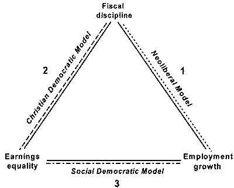  

.red[`r Citet(myBib, "iversenEqualityEmploymentBudgetary1998")`]
]

---
name: Sistemasbienestar1
background-position: 150% 150%
class: inverse, middle, center, animated bounceInDown
# Los sistemas del <br> Estado de bienestar
-----

---
name: Sistemasbienestar2
background-position: 150% 150%
class: middle, center
# Sistemas proveedores de bienestar
Adaptación de .red[`r Citet(myBib, "fantovaCalidadServiciosSociales2013")`]
<p align="center">

</p>
---
name: Sistemasbienestar3
background-position: 100% 100%
class: middle, center, animated flash
# Sistemas proveedores de bienestar
Adaptación de .red[`r Citet(myBib, "fantovaCalidadServiciosSociales2013")`]
<p align="center">

</p>
---
name: Sistemasbienestar4
background-position: 100% 100%
class: middle, center, animated bounceInDown
# Sistemas proveedores de bienestar
.pull-left[

]

---
name: Sistemasbienestar5
background-position: 100% 100%
class: middle, center, animated flash 
# Sistemas proveedores de bienestar

.pull-right[

]
---
name: Politicassociales1
background-position: 150% 150%
class: inverse, middle, center, animated bounceInDown
# Las políticas sociales
-----

---
name: Políticassociales2
background-position: 100% 100%
class: middle, center
# Las políticas sociales.pq[ (de los servicios sociales)]
<p align="center">
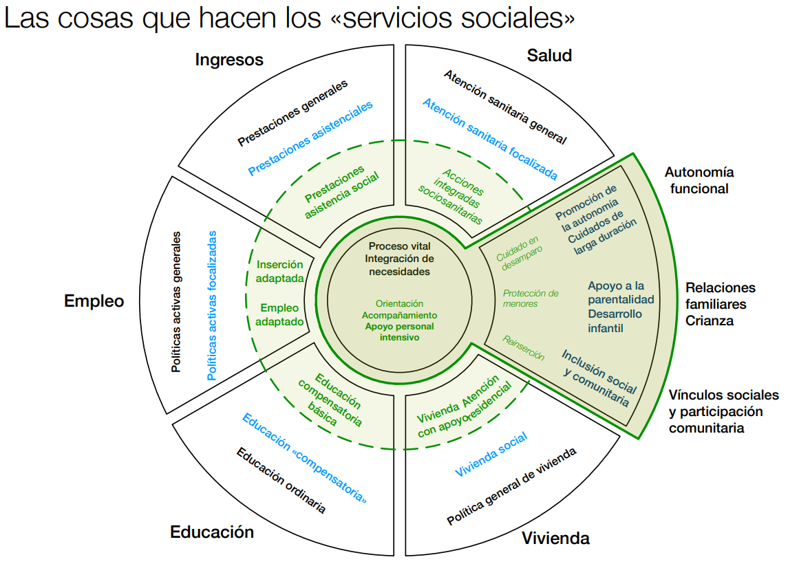
</p>


.red[`r Citet(myBib, "hendricksonResponsabilidadesIntegracionVertical2021")`]

---
name: Políticassociales3
class: top,
## .center[Las políticas sociales .pq[paradigmas]]
----
.pull-left[
.content-box-red[Enfoque de necesidades] <br><br>
.red[Enfoque de derechos] <br><br>
.red[Enfoque de inversión social] <br><br>
.red[Enfoque de capacidades] <br><br>
]
---
name: Políticassociales3
class: top,
## .center[Las políticas sociales .pq[paradigmas]]
----
.pull-left[
.content-box-red[Enfoque de necesidades] <br><br>
.red[Enfoque de derechos] <br><br>
.red[Enfoque de inversión social] <br><br>
.red[Enfoque de capacidades] <br><br>
]
.pull-right[
El objeto de la intervención pública es la cobertura de las necesidades de la Infancia y sus familias, especialmente en el ámbito de la protección  

>Estado Español, la Constitución de 1978, asigna a los poderes públicos, y más concretamente a los servicios sociales, la salvaguarda de derechos de la famíliay la Infancia (Art. 39 CE) y de la juventud (Art. 48) y asigna esta tarea los Servisios Sociales (art.9.2CE)  

.right[.red[`r Citet(myBib, "pratsServiciosSocialesMunicipales2002")`]
]
]
---
name: Políticassociales4
class: top,
## .center[Las políticas sociales .pq[paradigmas]]
----
.pull-left[
.red[Enfoque de necesidades] <br><br>
.content-box-red[Enfoque de derechos] <br><br>
.red[Enfoque de inversión social] <br><br>
.red[Enfoque de capacidades] <br><br>
] 

- [Convención sobre los Derechos del Niño](https://www.unicef.es/sites/unicef.es/files/comunicacion/ConvencionsobrelosDerechosdelNino.pdf) .red[`r Citet(myBib, "nacionsunidesConvencioDelsDrets1989")`]  
<br>
--
- Extiende los derechos humanos a la Infancia de forma explícita, y a la vez salvaguardaba sus especificidades.  
<br>
--
- Voluntad _transversalitzante_ de la Infancia (_child mainstreaming_) &rarr; desigualdades como en cobertura de necesidades + identidades &larr;&rarr; integrar reconocimiento y redistribución .red[`r Citet(myBib, "fraserJusticeInterruptusCritical2014")`].  
<br>
--
- Infancia como 'aún un no-ciudadano’, un sujeto subsidiario de las políticas familiares, al que se niega su personalidad y limita su potencial, silenciándolo .red[`r Citet(myBib, "rocheChildrenRightsParticipation1999")`].  
<br>
--
- Implícitamente: Infancia es un grupo social con intereses y un _set_ de derechos universales. __Respeto por otras aproximaciones culturales, de aprendizaje y de desarrollo de la Infancia__ .red[`r Citet(myBib, "whitePoliticsPovertyPolitics2002")`].  

---
name: Políticassociales5
class: top,
## .center[Las políticas sociales .pq[paradigmas]]
----

.pull-left[
.red[Enfoque de necesidades] <br><br>
.red[Enfoque de derechos] <br><br>
.content-box-red[Enfoque de inversión social] <br><br>
.red[Enfoque de capacidades] <br><br>
] 

**Hipótesis**  a través del desarrollo del capital humano -especialmente en primera Infancia  .red[`r Citet(myBib, c("europeancommissionHaciaInversionSocial2013", "europeancommissionInvertirInfanciaRomper2013"))`]  

--
* Retorno social de la inversión + reducción gasto económico de los programas restitutorios posteriores .red[`r Citet(myBib, c("heckmanSkillFormationEconomics2006", "heckmanProductivityArgumentInvesting2007", "elangoEarlyChildhoodEducation2015"))`]; y,  
<br>
--

* Ciudadanía adquirirá las competencias y habilidades que el mercado laboral del futuro requerirá .red[`r Citet(myBib, "europeancommissionNewSkillsAgenda2016")`].  

--
<br>
<u>**IMPLICACIONES:**</u>
<br>  
- **«Igualdad de oportunidades»** + **«activación»** ➡ anulan el conflicto de intereses entre clases, evitando la **«paradoja de la redistribución»** .red[`r Citet(myBib,"korpiParadoxRedistributionStrategies1998")`].  
<br>
--
- **Individualización**: incidir en las conductas, las motivaciones y las actitudes de los individuos.  
<br>
--
- **Proceso de re-mercantilización** La participación (y posición) en el marcado de trabajo  como mecanismo para la participación y la autonomía social y económica .red[`r Citet(myBib,"vandenbrouckeDisappointingPovertyTrends2011")`].  

---
name: Políticassociales6
class: top,
## .center[Las políticas sociales .pq[paradigmas]]
----

.pull-left[
.red[Enfoque de necesidades] <br><br>
.red[Enfoque de derechos] <br><br>
.content-box-red[Enfoque de inversión social] <br><br>
.red[Enfoque de capacidades] <br><br>
]  


- **Principio de contractualitzación**: del contrato social .red[➡] compromiso individual/moral .red[`r Citet(myBib,"morenoEuropeizacionBienestarActivacion2007")`].  

--
* La **política social es un factor productivo más**, un elemento que contribuye a la gestión de un cambio estructural, minimizando las consecuencias sociales negativas  .red[`r Citet(myBib, "cantillonParadoxSocialInvestment2011")`]  
<br>
--

* ¿Validez empírica de la meritocracia? .red[`r Citet(myBib, "barragueDerribandoDiqueMeritocracia2022")`]   

--
* **Paradoja de la inversión social**: servicios públicos de cuidados formales a la infancia: familias con dos fuentes de ingresos, mejores graduaciones educativas, y remuneraciones salariales más elevadas .red[`r Citet(myBib, c("ghyselsUnequalBenefitsActivation2011", "sarasaurdiolaDeferredEffectsNursery2011"))`].  


---
name: Políticassociales7
class: top
## .center[Las políticas sociales .pq[paradigmas]]
----

.pull-left[
.red[Enfoque de necesidades] <br><br>
.red[Enfoque de derechos] <br><br>
.red[Enfoque de inversión social] <br><br>
.content-box-red[Enfoque de capacidades] <br><br>
]  

Marco analítico y normativo .red[`r Citet(myBib, "nussbaumQualityLife1993")`].  
<br>
--
- Bienestar orientado hacia aquello que las personas son libres de **hacer** y **ser** («capacidades»), más allá de lo que al final **decidan** desarrollar en una u otra dirección  («funcionalidades»).   
<br>
--
- Integra la Infancia como *sujeto-ahora-y-aquí* (‘*beings*’) + contexto cultural, social y económico de la realidad temporal y geográfica; pero a la vez orientado hacia el futuro (‘*becomings*’).red[`r Citet(myBib, c("galvez-munozGenderTimeUse2013", "dominguez-serranoBienestarInfanciaIndicadores2016", "dominguez-serranoRelevantCapabilitiesRelevant2018","mayordomoIntervencioAmbInfants2018"))`]. 

--
- Los *poderes públicos* actúan como «capacidades externas» que **generan funciones adicionales**
.red[`r Citet(myBib, "fosterExternalCapabilities2008")`], una tarea especialmente relevante para la Infancia, + para la primera infancia, donde el proceso de desarrollo está muy influenciado por la interacción entre la agencia de un nin@ y sus cuidadores .red[`r Citet(myBib, "traniDisabilitiesCapabilityApproach2011")`]  

---
name: desorienta1
class: top, inverse, center, animated bounceInDown
# ¿_Cierta desorientación..._?


---
name: infancia
class: inverse, middle, left
# II PARTE: Las políticas de Infancia

.pull-left[.full-width[.content-box-red[
<br><br><br><br><br><br><br>
[ - 5 argumentos a favor de las políticas de infancia](#arguments)  

[ - Coordenadas para las políticas de infancia](#coordenadas)  

[ - Un ejemplo de estructuración de las políticas de infancia y la adolescencia: el caso de Catalunya.](#LDOIA)  

[ - Proceso de intervención.](#intervencio)  

]
]
]

.pull-right[
<p align="center">

</p>
]

---
name: arguments
class: middle, inverse, center, animated bounceInDown
# 5 argumentos a favor de las políticas de infancia
----
---
name: arguments1
class: top
### 5 argumentos a favor de las políticas de infancia .left[.pq[1.Plasticidad]]
<div align="center">
<iframe width="700" height="550" src="https://www.youtube.com/embed/m_5u8-QSh6A" frameborder="0" allowfullscreen></iframe>
   </iframe>
</div>

---
name: arguments2
class: top
### 5 argumentos a favor de las políticas de infancia .left[.pq[2.Pre-distribución]]  

> Una intervención que actúa más sobre las causas que sobre las consecuencias de la desigualdad y la pobreza, una especie de acción preventiva o ex ante, frente a una redistribución que consistiría en acciones curativas o ex post, una vez las situaciones de necesidad o desventaja ya se han producido.   

.red[`r Citet(myBib, "nogueraPredistribucionQueHablamos2015")`]
   
  
--

  
> La mejor política social es una política pro-activa, que pone énfasis en iniciativas de capacitación y empoderamiento individual, con el objetivo no solo en proporcionar un cojín contra situaciones de infortunio, sinó de activar cualidades que favorezcan la autonomía de los individuos y refuercen su valor en el mercado de trabajo. 

.red[`r Citet(myBib, "mari-klosePobresaInfantilPreredistribucio2015")`]

---
name: arguments3
class: top
### 5 argumentos a favor de las políticas de infancia .left[.pq[3.Rentabilidad - inversión]]
<div align="center">
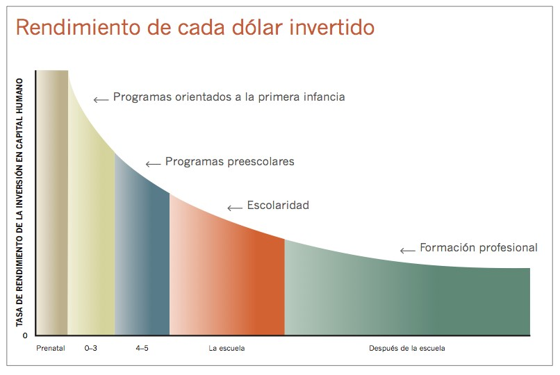  
</div>
.center[.red[`r Citet(myBib, "heckmanSkillFormationEconomics2006")`]]

---
name: arguments4
### 5 argumentos a favor de las políticas de infancia .left[.pq[4.Cohesión social]]
<div align="center">
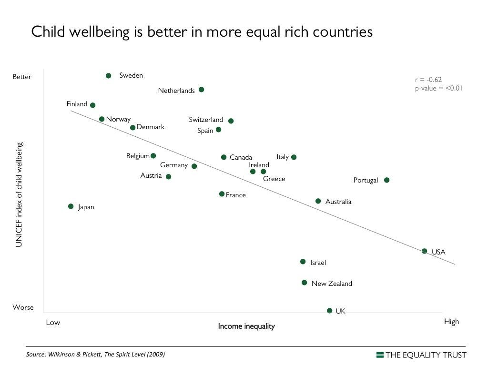  
</div>

.center[.red[`r Citet(myBib, "pickettSpiritLevelWhy2010")`]]

---
name: arguments5
### 5 argumentos a favor de las políticas de infancia .left[.pq[5.Romper el ciclo]]

.pull-left[
<br><br><br><br>
**Transmisión intergeneracional de la pobreza**    

Riesgo diferencial de las personas nacidas en hogares _pobres_ a sufrir  problemas económicos (pero no solo) al largo de su vida adulta.
]  

.pull-right[
<div align="center">
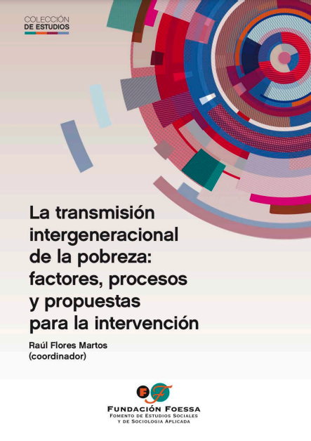  
</div>
.center[.red[`r Citet(myBib, c("europeancommissionInvertirInfanciaRomper2013","floresmartosTransmisionIntergeneracionalPobreza2016"))`]]
]
---
name: cafe
class: top, inverse, center, animated bounceInDown
#.center[P A U S A  -   C A F É]

---
name: coordenadas
class: middle, inverse, center, animated bounceInDown
# Coordenadas para las políticas de infancia
----
---
name: coordenadas
class: top
# Las políticas de infancia .left[.pq[En resumen:]]
---- 
* Contexto de profunda transformación del estado del bienestar familiarista.   
  
--

* Límites a la vocación universalista del sistema de servicios sociales.   

--

* Misión de las políticas atribuidas a los servicios sociales muy ambiciosas, pero poco dotadas y desarrolladas.    


--

* Una diseño de las políticas de infancia muy próximas a un enfoque de cobertura de necesidades.    

--

* Gran fragmentación de las políticas de infancia: entre administraciones y entre ámbitos de intervención de éstas.    

---
name: LDOIA
class: inverse, middle, left
### Un ejemplo de estructuración de las políticas de infancia y la adolescencia: el caso de Catalunya.
----
.pull-left[.full-width[.content-box-red[
- [LLEI 14/2010, del 27 de maig, dels drets i les oportunitats en la infància i l'adolescència.](#LDOIA1)  

- [DECRET 250/2013, de 12 de novembre, de la Taula Nacional i les taules territorials i locals d’infància.](#LDOIA4)  

- [Ordre BSF/331/2013, de 18 de desembre, per la qual s'aproven les llistes d'indicadors i factors de protecció dels infants i adolescents](#LDOIA5)  

]
]
]

.pull-righ[
<p align="center">

</p>
]

---
name: LDOIA1
class: top, left
### [Llei dels drets i les oportunitats en la infància i l'adolescència (LDOIA)](https://portaljuridic.gencat.cat/eli/es-ct/l/2010/05/27/14)
<div align="center">
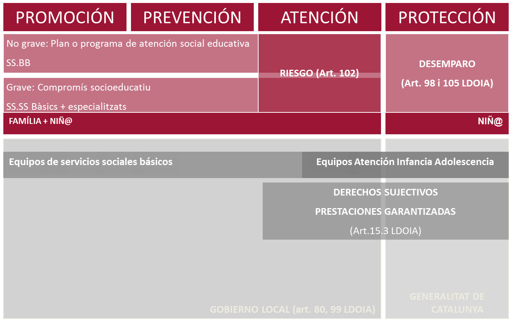  
</div>
---
name: LDOIA2
class: top, left
### [Llei dels drets i les oportunitats en la infància i l'adolescència (LDOIA)](https://portaljuridic.gencat.cat/eli/es-ct/l/2010/05/27/14)
<div align="center">
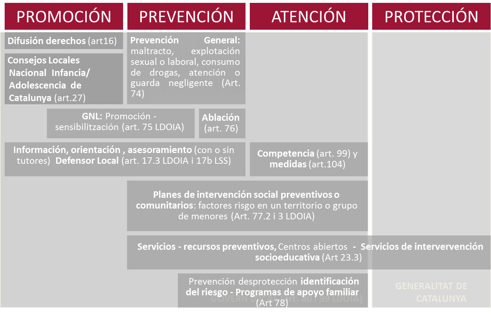  
</div>
---
name: LDOIA3
class: top, left
### [Llei dels drets i les oportunitats en la infància i l'adolescència (LDOIA)](https://portaljuridic.gencat.cat/eli/es-ct/l/2010/05/27/14)
<div align="center">
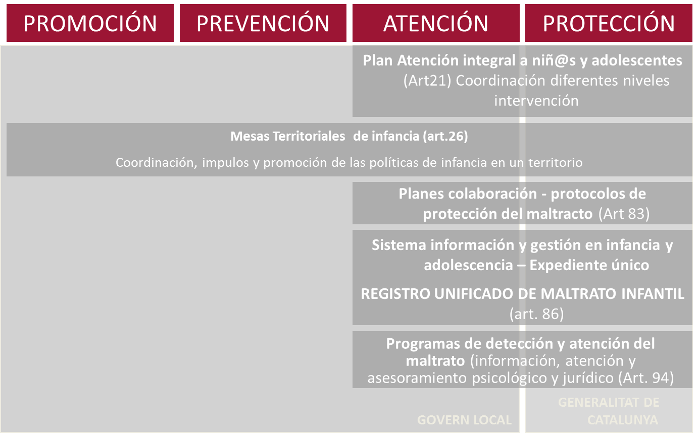  
</div>

.red[`r Citet(myBib, "heckmanSkillFormationEconomics2006")`]
---
name: LDOIA4
class: top, left
### [DECRET 250/2013, de 12 de novembre, de la Taula Nacional i les taules territorials i locals d’infància ](https://portaljuridic.gencat.cat/eli/es-ct/d/2013/11/12/250)
----


* **Dispersión de las políticas**: Coordinar los equipos, servicios y agentes implicados en un determinado territorio y ser más eficientes en la promoción de la promoción y participación, la prevención, la detecció y protección de la infancia la adolescencia y sus familias.]      


--
* Las coordinaciones, el trabajo en red o la co-creación de políticas (según el grau de integración) no son un objetivo en si mismo, sinó que responden a una **lógica de mejora de la eficiència de la gestión** y de **lograr una  contribución mayor de las políticas**     


--
* Importancia del **factor territorial**: Escala autonómica, delegaciones territoriales, comarcal y/o local     


.right[más en .red[`r Citet(myBib, "mayordomomartinezInfanciaGobernanzaCompleja")`]]

---
name: LDOIA5
class: top, left
### Ordre BSF/331/2013, de 18 de desembre, per la qual s'aproven les llistes d'indicadors i factors de protecció dels infants i adolescents
[Consultar Ordre BSF/331/2013](https://portaldogc.gencat.cat/utilsEADOP/PDF/6530/1331821.pdf)   
<div align="center">
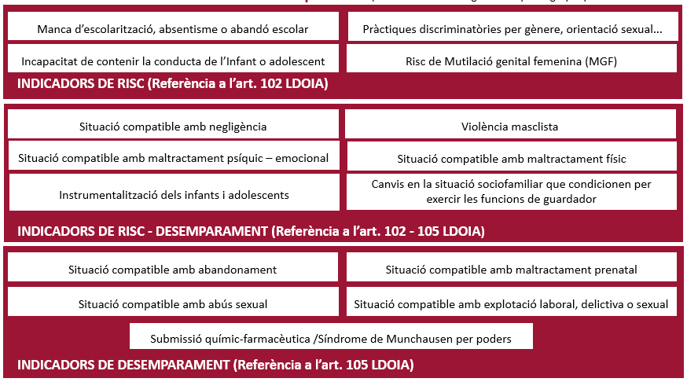  
</div>
---
name: LDOIA6
class: top, left
# Herraminetas de cribado  
----
### Mòdul de suport a la gestió del risc (MSGR)  

Herramienta para profesionales ajenos a los servicios sociales que les permite orientar su intervención en caso de sospecha de maltrato o abuso a niños o adolescentes. [MSGR](https://dps.gencat.cat/rumi/#/simulacio/inici-simulacio)   

--
### Instrument de cribratge per a la discriminació de les situacions de risc i desemparament

Algoritmo que orienta la exploración y derivación de las profesionales de los Servicios sociales de primaria y de los especializados. [Eina de cribatge de situacions de risc i desemparament](https://dretssocials.gencat.cat/web/.content/03ambits_tematics/07infanciaiadolescencia/recursos_professionals/pdf/eina_cribratge.pdf)  

---
name: intervencio
class: middle, inverse, center, animated bounceInDown
# Coordenadas para las políticas de infancia
----
---
name: intervencio1
class: top
# El proceso de intervención social
----
<br><br>
<div align="center">
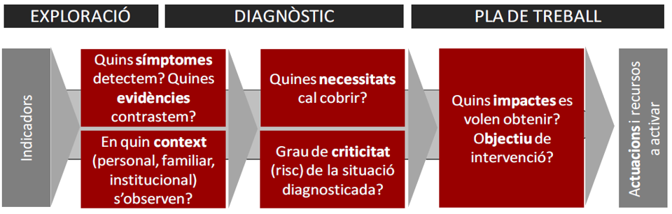  
</div>
---
name: intervencio2
class: top, inverse, animated bounceInDown
# Una misión . . . 
.left[.content-box-red[.red[¿Qué contribución realizan las políticas en la reducción de la desigualdad?]] ]

.right[.content-box-red[.red[¿Qué contribución realizan las las intervenciones sociales en la promoción de las personas?]]]
<br><br>
<div align="center">
  
</div>

---
name: intervencio3
class: top, inverse, center, animated bounceInDown
# ... la misión de las políticas .left[.pq[¿ _Des de donde pensamos_ la lucha contra la desigualdad?]]
----
<br>
<div align="center">
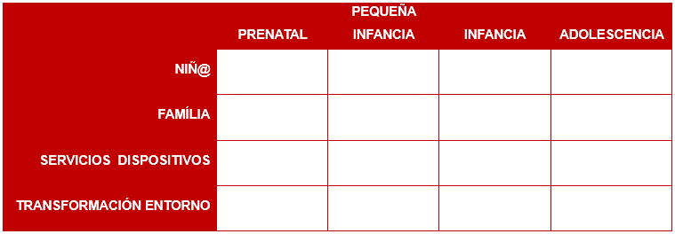  
</div>

---
name: debat
class: middle, inverse, center, animated bounceInDown
# PARTE FINAL: Más intercambio de visiones.
----
---
name: Thks
class: inverse, middle, center, hide-logo
# ¡Muchas grácias!
----
### Para cualquier sugerencia o duda:
  
<br>
<b>·</b> 
[`r fontawesome::fa("envelope", a11y = "sem", fill = "#FFFFFF")` ](mailto:eloimm@yahoo.com)<b>·</b> 
[`r fontawesome::fa("laptop", a11y = "sem", fill = "#FFFFFF")` ](https://eloimm.github.io/)<b>·</b> 
[`r fontawesome::fa("twitter", a11y = "sem", fill = "#FFFFFF")` ](https://twitter.com/eloimm) <b>·</b>
[`r fontawesome::fa("mastodon", a11y = "sem", fill = "#FFFFFF")` ](mastodont.cat/@eloimm)<b>·</b> 

<br>
[`r fontawesome::fa("laptop", a11y = "sem", fill = "#FFFFFF")` .white[bit.ly/AulaSS]](bit.ly/AulaSS)  <b>·</b> 
[`r fontawesome::fa("fas fa-file-pdf", a11y = "sem", fill = "#FFFFFF")` .white[bit.ly/AulaSSPDF]](bit.ly/AulaPDF)
---
name: biblio
class: middle, inverse
# .center[Bibliografía]
* * *

---
name: biblio1
# Bibliografía

```{r, results='asis', echo=FALSE}
PrintBibliography(myBib, start = 1, end = 6)
```

---
name: biblio2
# Bibliografía

```{r, results='asis', echo=FALSE}
PrintBibliography(myBib, start = 7, end = 12)
```
---
name: biblio3
# Bibliografía

```{r, results='asis', echo=FALSE}
PrintBibliography(myBib, start = 13, end = 19)
```

---
name: biblio4
# Bibliografía

```{r, results='asis', echo=FALSE}
PrintBibliography(myBib, start = 20, end = 26)
```

---
name: biblio4
# Bibliografía

```{r, results='asis', echo=FALSE}
PrintBibliography(myBib, start = 26, end = 30)
```


```{r, renderthis, eval=FALSE}
#install.packages("renderthis")
# remotes::install_github('rstudio/chromote')
#library(renderthis)
#renderthis::to_pdf("Aula.Rmd")
#usethis::use_git()
#usethis::use_github()
```

